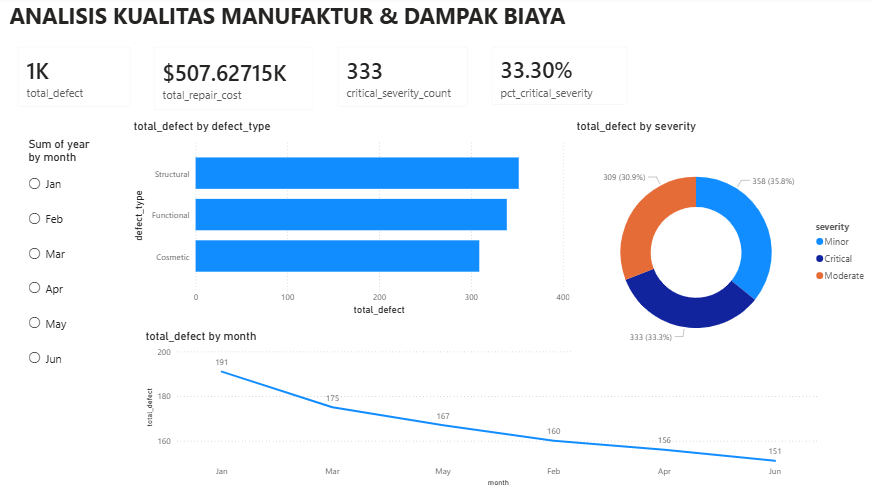
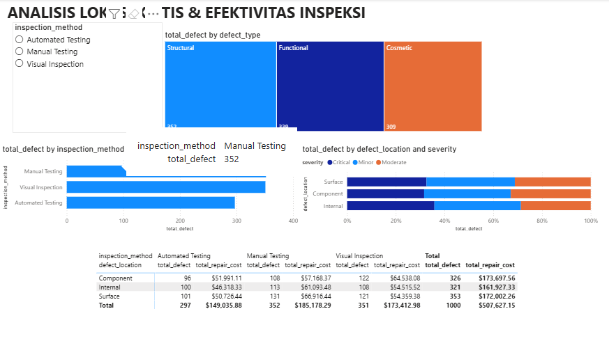
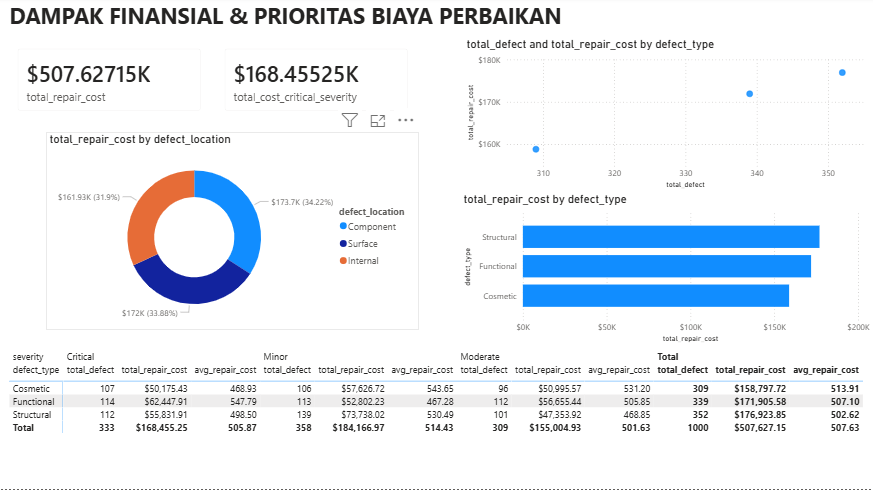

# PowerBI_Manufacturing_QC_Analysis
Analisis Power BI mengenai simulasi cacat manufaktur dan biaya perbaikan

##  Tujuan Proyek
Proyek ini bertujuan untuk menganalisis data cacat manufaktur simulasi untuk mengidentifikasi pola kualitas, menilai efektivitas proses kontrol kualitas (QC), dan menentukan penggerak biaya utama untuk perbaikan strategis.

##  Metodologi dan Tools
* **Tools:** Microsoft Power BI Desktop (Visualisasi & DAX), Microsoft Excel (Cleaning).
* **Teknik Analisis:** Analisis Pareto, Analisis Tren Temporal, Pemodelan Data Relasional (Calendar Table), Analisis Dampak Biaya.

---

##  Insights

### 1. Dampak Finansial yang Tidak Proporsional (Anomali Biaya)

Meskipun **Structural** dan **Functional** adalah cacat bervolume tertinggi, analisis menemukan inefisiensi biaya yang signifikan pada Cacat Kosmetik.

* **Penyebab Biaya Utama:** Cacat **Structural** dan **Functional** menyumbang sekitar **68%** dari Total Biaya Perbaikan ($507K).
* **Anomali Biaya Unit:** Cacat **Cosmetic** memiliki **Biaya Perbaikan Rata-Rata Per Unit (Avg Repair Cost)** yang paling tinggi di seluruh kategori keparahan, yang mengindikasikan bahwa perbaikan cacat permukaan yang seharusnya mudah justru memerlukan penggantian komponen mahal atau proses yang tidak efisien.

### 2. Risiko Kualitas yang Tinggi

Analisis menunjukkan bahwa risiko kualitas secara keseluruhan sangat tinggi dan terdistribusi secara merata.

* **Tingkat Kritis:** **33.3%** dari total cacat diklasifikasikan sebagai **Critical Severity**.
* **Lokasi Cacat:** Biaya perbaikan terdistribusi hampir merata di antara semua lokasi (**Component, Surface, Internal**), yang menunjukkan bahwa masalah kualitas bersifat sistemik dan tidak terisolasi pada satu area produksi.

### 3. Gap dalam Proses Kontrol Kualitas (QC)

* **Metode Mahal:** Cacat yang ditemukan melalui **Manual Testing** memiliki rata-rata biaya perbaikan per unit **dua kali lebih mahal** dibandingkan metode lainnya. Hal ini mengindikasikan bahwa cacat kompleks terdeteksi terlambat, menunjukkan adanya celah dalam *Automated Testing*.

---

##  Rekomendasi Strategis

Berdasarkan temuan di atas, direkomendasikan tindakan berikut:

1.  **Audit Proses Perbaikan:** Melakukan audit segera terhadap proses perbaikan Cacat **Cosmetic** dan **Manual Testing** untuk memahami mengapa biaya rata-rata unitnya sangat tinggi.
2.  **Peningkatan Automated Testing:** Selidiki celah dan parameter yang digunakan *Automated Testing* untuk memastikan mampu mendeteksi cacat tersembunyi/kompleks lebih awal.
3.  **Fokus Eliminasi Volume:** Prioritaskan perbaikan proses produksi untuk mengurangi volume cacat **Structural** dan **Functional** (penggerak volume dan biaya tertinggi).

---

##  Tinjauan Dashboard

**[Halaman 1: Executive Summary]**

**[Halaman 2: Root Cause Analysis]**
`

**[Halaman 3: Financial Impact]**
`
.
